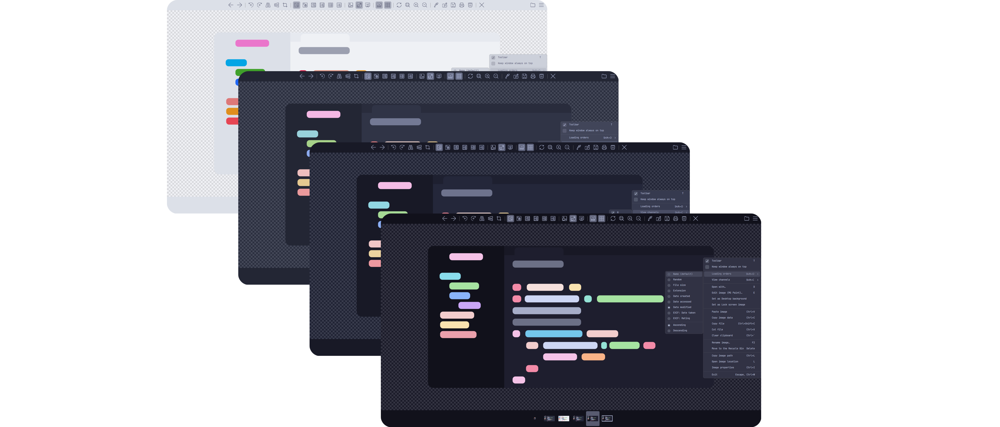
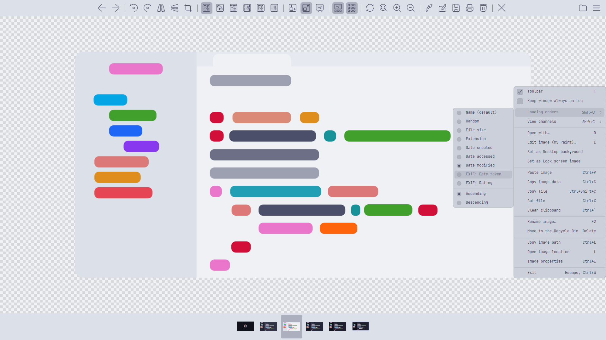
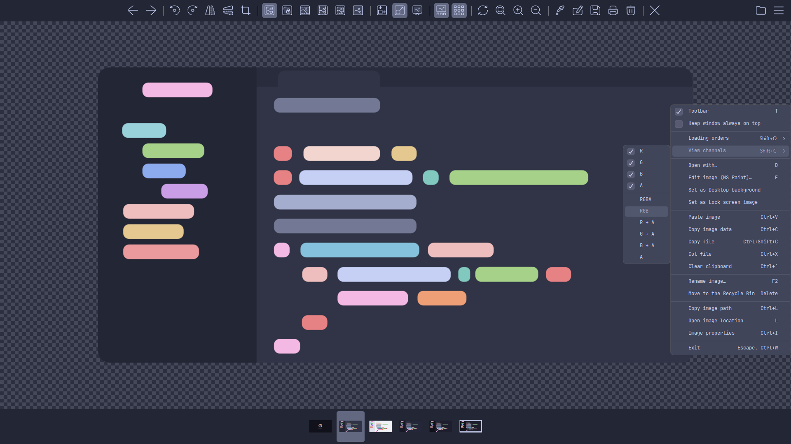
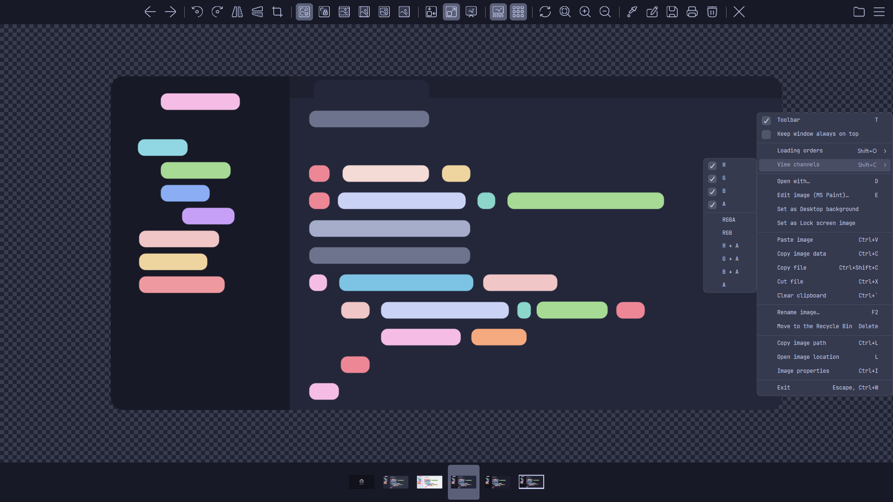
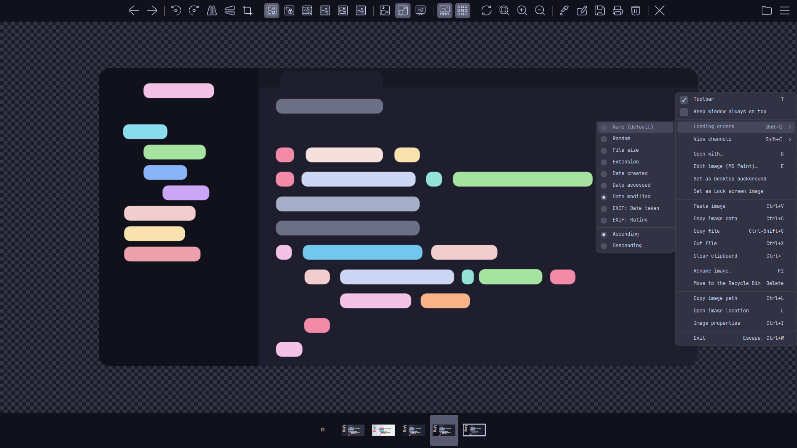

<h3 align="center">
	 
	
	Catppuccin for <a href="https://imageglass.org">ImageGlass</a>
	
</h3>

	
	
	

	

## Previews

🌻 Latte

🪴 Frappé

🌺 Macchiato

🌿 Mocha

## Usage

1. Download your preferred flavor from the [latest release](https://github.com/Courage-1984/imageglass/releases/latest)
2. Open ImageGlass
3. Click on the menu button (☰) in the top-right corner
4. Go to Settings > Appearance
5. Click on "Install…" and select the downloaded `.igtheme` file
6. Select the newly installed Catppuccin theme from the list (Dark/Light)
7. Click "Apply" to activate the theme

## 💝 Thanks to

- [Courage-1984](https://github.com/Courage-1984)

&nbsp;

	

	Copyright &copy; 2021-present <a href="https://github.com/catppuccin" target="_blank">Catppuccin Org</a>

	

